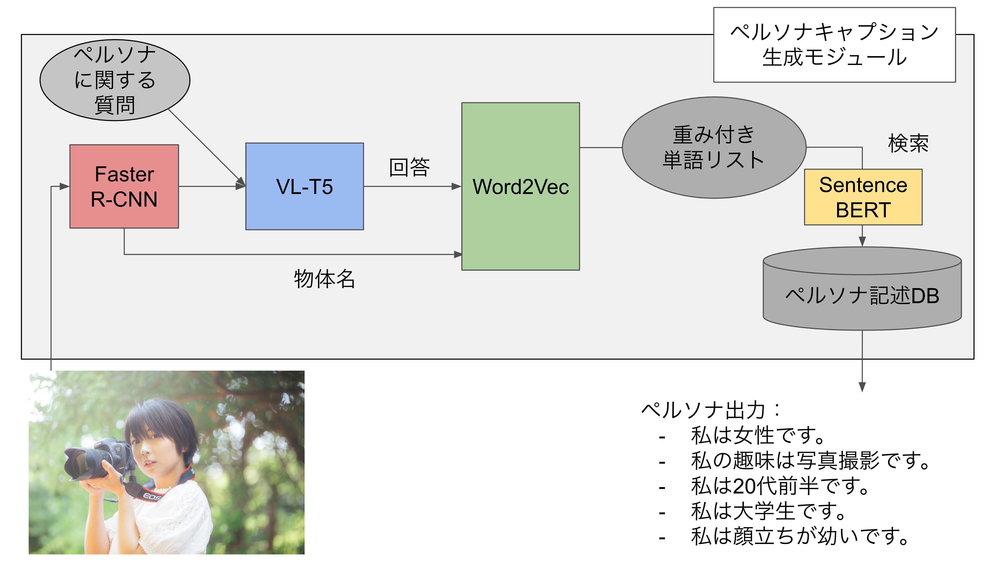

## Persona Caption Dialog

人物画像を使った、なりきりTelegramボット

## アーキテクチャ

人物画像からその人物のペルソナを推測して出力する「ペルソナキャプション生成」モジュールと、出力されたペルソナをもとに雑談対話を行う「ペルソナ対話」モジュールから構成されています。

### ペルソナキャプション生成

### ペルソナ対話

## 実行

1. Telegramトークンの設定: `export TOKEN=<YOUR TELEGRAM BOT TOKEN>`
2. JPersonaChatでファインチューニング済みGPT2モデルを`GPT2/model/`以下に配置する
   1. ファインチューニングには[kassy11/convai_jpersona: ConvAI finetuned by JPesonaChat](https://github.com/kassy11/convai_jpersona)を利用してください
3. Telegramボットを起動: `python bot.py`

## 対話例
